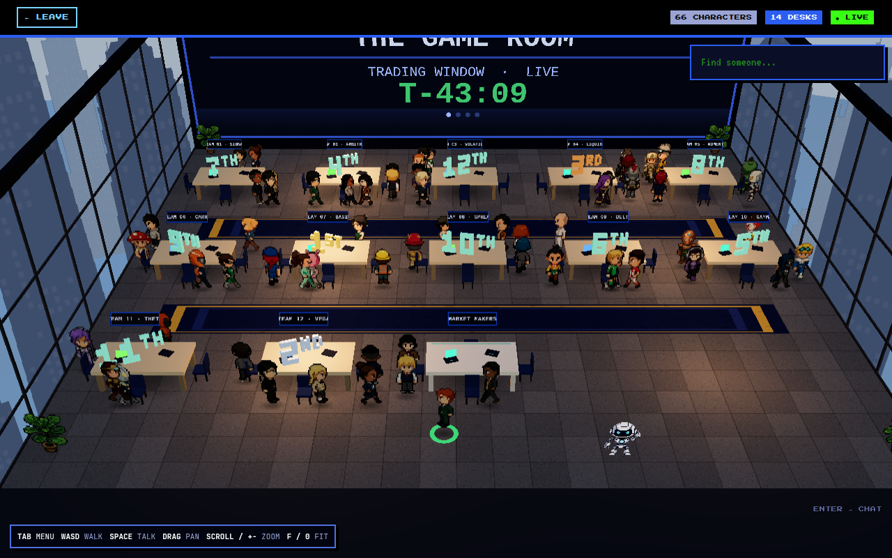

# gameroom

A 3D pixel-art **game room** that shows your agents at work. Drop it into a
React app, hand it a list of agents with statuses, and each one becomes a
character at a desk: walking laps while it works, standing with a bubble
when it needs you, keeling over when it breaks. Walk your own character up
to one and press `E` to ask it what it is doing.

It began as the game room of a hackathon site and was cut loose from it: no
sign-in, no database, no scoreboard. Agents are whatever your app says they
are; the room only draws them.



## Run the demo

```bash
bun install
bun run dev          # the app on :3000, the visitors' hub on :8787
```

Open <http://localhost:3000>, pick a character, walk in (`WASD`, `E` or
`Space` to talk, `Tab` for the menu, `Enter` to chat). The demo's agents are
a pretend runtime that changes them every few seconds; the header pauses it
and raises a bulletin. Open a second window to meet yourself. The
gamemaster's console is at <http://localhost:3000/#console>.

Node 20+ or Bun 1.2+. The hub is a Bun script; everything else runs anywhere.

## Embed it

```tsx
import { GameRoom, AudioProvider, type Agent } from "@gameroom/react"
import "@gameroom/react/styles.css"

const agents: Agent[] = [
  { id: "planner", name: "Planner", status: "working", activity: "Breaking the task into steps" },
  { id: "coder", name: "Coder", status: "waiting", activity: "Needs approval to run tests" },
  { id: "fetcher", name: "Fetcher", status: "working", parentId: "planner" },
  { id: "deployer", name: "Deployer", status: "error", activity: "502 from the registry" },
]

<AudioProvider defaultMuted={false}>
  <GameRoom
    agents={agents}
    me={{ id: "u1", name: "Wei Ming", spriteId: 7 }}
    onReady={(room) => (roomRef.current = room)}
    onAgentInteract={(agent) => roomRef.current?.say(agent.id, agent.activity ?? "Nothing to report.")}
    onExit={() => router.back()}
  />
</AudioProvider>
```

Serve `node_modules/@gameroom/react/public/assets/**` at `/assets` — the room
loads its sheets and textures by URL. No server is needed: the room is
single-player until you give it a hub (below).

Three levels, take what you want:

| | |
| --- | --- |
| `<GameRoom>` | the whole thing: room, menu, chat, music, games, and the hub wiring. |
| `<GameRoom3D>` | the scene, with your own UI around it. |
| `<Room3DViewport>` | the canvas, driven imperatively through a scene handle. |

Standalone pieces: `<CharacterPicker>`, `<AgentFinder>`,
`<GameRoomControlPanel>`, `<ArcadePortal>`, `<BackroomsPortal>`,
`<DuelPortal>`, `<AudioProvider>`.

## Agents

An agent is an id, a name and a status. Hand in a new array whenever
anything changes; the room diffs it and moves only what moved.

```ts
interface Agent {
  id: string
  name: string
  status: "idle" | "working" | "waiting" | "done" | "error" | "offline"
  activity?: string        // the bubble over its head
  parentId?: string        // a sub-agent: follows its parent in a line
  sprite?: number | string // a stock sheet index, or a URL to your own 6×4 sheet
  color?: string           // halo tint, when the status colour isn't it
}
```

**Status is motion.** A working agent walks laps around its desk with a
"Working…" bubble. Every other status stands where it is, still marching on
the spot: waiting is amber and breathes, done is blue, error holds the hurt
frame in red, offline is dimmed with no halo, idle is just there. All of it
is a table you can override per status through `statusStyles`:

```ts
<GameRoom statusStyles={{ waiting: { bubble: "Needs a decision", halo: "#FF8800" } }} />
```

**Children follow.** An agent with a `parentId` walks in a line behind the
top of its family, and a working child makes its parent working, so the
family's head tells you the family is busy.

**Talk to one.** Walk up and press `E`: `onAgentInteract(agent)` fires and
the room waits. Answer through the handle `onReady` gives you —
`room.say(agent.id, text)` puts a bubble over its head. What an agent says is
your business; the room has no opinion.

**Seating.** Eleven desks, six slots each, filled emptiest-first; a new
agent walks in from the aisle, a removed one fades where it stands. Past
sixty-six the rest stand in the aisle. There is no cap in the code.

**The wall.** A screen the width of the room. By default it shows how many
agents there are and how many are working, waiting or in trouble. Hand in
`board={{ title, lines }}` for your own page, and `bulletin={{ text }}` to
raise an alert: every camera in the room turns to read it, then hands the
view back.

## What is in the room

**The characters.** 132 walk-cycle sheets. Your visitor picks one in the
wardrobe (`<CharacterPicker>`); an agent gets one derived from its id unless
you pass `sprite`. A host with its own generator hands a finished sheet in
and the picker offers it alongside the pool.

**The finder.** `<AgentFinder>` sits in the corner: type a name, pick one,
and the camera goes to it with its card open.

**The music.** Four ambient loops and the theme in eight arrangements,
alternating. The gamemaster can put one track on, or stop it — and that
command only reaches hosts and screens, never a visitor's laptop.

## The three easter eggs

Nothing in the UI mentions any of them. In rough order of how findable they are:

1. **Table Stakes** — the two white desks seat nobody. Press `E` at one and
   the house deals you into a card duel.
2. **Impact Hackers** — the Konami code (↑↑↓↓←→←→BA, or the same on the touch
   D-pad) drops an arcade cabinet into the room with a fighting game in it.
3. **The Backrooms** — a hatch, and what is through it. Finding the way in is
   the puzzle; the clue for a fourth thing is scrawled on a wall down there.

The fourth thing needs a microphone and is left as an exercise. Primey, the
mascot, will point you at the agents if you ask.

## The hub

Other people are optional. With `hub` on, `<GameRoom>` connects to a
visitors' hub — SSE down, POST up, one in-memory authority
(`src/server/hub.ts`) for where every human is — and the other visitors walk
around in your room, talk to you, and chat. Agents never touch it: every
client walks the same agents from the same props, so nothing about them is
relayed.

`server/hub-server.ts` is a small Bun server that serves it. Tell it who
your visitors are:

```ts
import { getGameRoomHub } from "@gameroom/react/hub"

const hub = getGameRoomHub({ loadVisitor: (id) => lookUpVisitor(id) })
```

Routes the client speaks: `GET /api/game-room/stream`, `POST
/api/game-room/{input,interact,chat,dismiss}`, and `/api/room/{music,bulletin}`
for the console. `configureGameRoomApi({ baseUrl })` points the room at them.

**Without a hub** the room is single-player: your character still walks,
the plants still talk, the hatch still opens on the tenth try. Chat stays
closed, since there is nobody to chat with.

## The gamemaster's console

`<GameRoomControlPanel>` is one card, and both buttons on it are commands to
the room rather than to a page:

- **MESSAGE TO THE ROOM** — a bulletin: every wall in the room shows it and
  every camera turns to read it, for as long as you say.
- **MUSIC** — a track, silence, or the room's own playlist, on the hosts'
  and screens' speakers.

Both need the hub; a host with no hub raises bulletins through the
`bulletin` prop instead.

## What was deliberately left out

- **Sign-in.** `me` is whoever you say it is. Put your own auth in front.
- **An agent runtime.** The demo fakes one with a timer. Yours is whatever
  produces the `agents` array.
- **The AI character generator.** It was a ComfyUI pipeline and an asset store;
  a component cannot carry that. The picker keeps the pool, the shared library
  and RANDOMLY PICK.
- **The hackathon.** Teams, standings, presentations, winners, fireworks and
  filmed broadcasts all went with the event this room was lifted from.

## Scripts

| | |
| --- | --- |
| `bun run dev` | app + hub |
| `bun run build` | the demo app |
| `bun run build:lib` | the library (`dist/`) |
| `bun run test` | 930 tests, no network, no database |
| `bun run typecheck` | `tsc --noEmit` |

Tests must run under Node, not Bun — `bun run test` does the right thing.

## Licence

MIT for the code. The art and audio have their own terms: see
[ASSETS.md](ASSETS.md).
